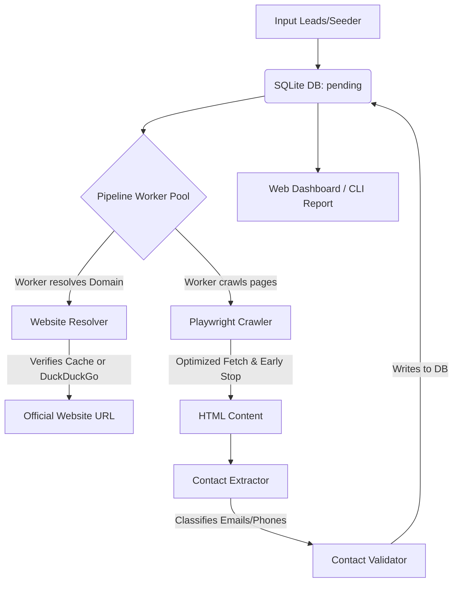

# Industry Contact Discovery System

An autonomous, production-grade Python application that discovers publicly listed institutional contact information (emails and phones) from official industry/company websites — designed for B2B CRM enrichment at 100,000+ industry scale.

This project has been enhanced with a **FastAPI backend web server**, a **modern dual-theme UI dashboard**, and **high-speed crawler optimizations** allowing it to discover hundreds of leads in minutes.

---

## Key Features

* 💻 **Premium Web Dashboard** — A clean, responsive dashboard designed with a light theme by default, complete with a dark mode toggler.
* 🚦 **Interactive Controls** — Start/stop the scraper live, control active workers concurrency dynamically via a slider, and track active URLs in real-time.
* 🎯 **Advanced Data Filters** — Filter your leads in real-time by crawl status, industry sector, or **contact/email types** (General, HR, Executive, Phone, or No Contact).
* 📥 **CSV Exporter** — Stream your filtered dashboard view directly to a CSV file.
* ⚡ **Crawler Speed Optimizations**:
  * **Early Stop**: Breaks the crawl navigation loop as soon as both a valid email and phone number are discovered.
  * **Conditional Wait**: Instantly parses loaded pages and skips the Playwright 1.5-second Javascript execution wait if contacts are present in the raw HTML.
* 🇮🇳 **Pre-defined India Sectors Seeder** — Instantly seed ~120 or 500+ leads across 6 sectors in India: Industrial Manufacturing, Warehouse & Cold Storage, Educational Institutes, Factories, Offices Workplace Management, and Hospitals.
* 💾 **SQLite Storage** — Incremental saves with resume on interrupt capability (never lose progress).

---

## How It Works



### 1. Website Resolution (`crawler/website_resolver.py`)
If a lead does not have a website URL, the system uses DuckDuckGo and search heuristics to locate the official homepage. Verified homepages are cached in a SQLite table (`website_cache`) to avoid repeated search queries.

### 2. Playwright Crawling (`crawler/page_crawler.py`)
Active workers fetch pages in headless browser contexts. 
* **Wait Optimization**: If contact details are detected in the initial HTML, the worker skips the 1.5-second JavaScript rendering wait.
* **Navigation Tree**: The crawler navigates from the home page to contact-rich subpages (e.g., Contact Us, About, Careers, Team).
* **Early Stop**: If both an email and a phone number are discovered, the worker immediately aborts the crawl loop for that website and writes the result.

### 3. Contact Classification & Validation (`extractors/` & `validators/`)
* **Emails**: Extracted and classified using keywords (e.g., matching `careers@`, `hr@`, `jobs@` for HR, or `ceo@`, `director@` for Executives).
* **Phones**: Extracted and normalized to E.164 format (with default country code set to `IN`).

---

## Project Structure

```
leads/
├── app/              
│   ├── static/index.html   # Premium Glassmorphic Web Dashboard UI
│   ├── web_server.py       # FastAPI web server serving static files & REST API
│   ├── sample_data.py      # India-focused seed dataset of 60 leads
│   ├── pipeline.py         # Pipeline orchestrator managing asyncio queue workers
│   └── logger.py           # Rotating logging handlers
├── crawler/          
│   ├── page_crawler.py     # Playwright page crawler (Early Stop/Conditional Wait)
│   └── website_resolver.py # Domain resolver with DuckDuckGo fallback
├── extractors/       # Email & Phone regex classifiers
├── validators/       # Contact details validity checks
├── storage/          # SQLite database connection & schema
├── logs/             # Rotation log files (crawl.log, error.log)
├── scratch/          
│   └── generate_500_leads.py # Custom script to seed 540 unique Indian leads
└── main.py           # CLI Entrypoint (run, status, report, web)
```

---

## How to Run the Web Dashboard

### 1. Installation
Ensure python is installed, then install dependencies:
```bash
# Initialize venv and install dependencies
.venv\Scripts\python.exe -m pip install -r requirements.txt

# Install Playwright Chromium dependencies
.venv\Scripts\playwright install chromium
```

### 2. Run the Web Server
Launch the FastAPI server on port 8000:
```bash
.venv\Scripts\python.exe main.py web --port 8000
```

### 3. Open Dashboard
Navigate to [http://127.0.0.1:8000](http://127.0.0.1:8000) in your web browser.

### 4. Seed and Scraping (Real-world Indian Dataset)
* **To Seed 120 Leads**: Click the **Seed Indian Sectors** button on the sidebar.
* **To Seed 548 Unique Leads**: Open a separate terminal and run our custom seeder script:
  ```bash
  .venv\Scripts\python.exe C:\Users\NNT\.gemini\antigravity\brain\97840bbd-f15f-4344-a3a5-98ebaca0590a\scratch\generate_500_leads.py
  ```
* **Run Scraper**: Click **Start Discovery Scraper** in the UI to crawl them in the background (completes in ~10-15 minutes).
* **Export**: Filter by status/email type and click **Export CSV** to download.

---

## How to Run via CLI

You can also operate the system entirely using the command-line interface:

### Run Crawler on Input CSV/Excel
```bash
.venv\Scripts\python.exe main.py run --input data/sample_industries.csv --workers 20
```

### Resume Interrupted CLI Run
The database saves progress incrementally. If you interrupt a run, resume simply with:
```bash
.venv\Scripts\python.exe main.py run
```

### Check Database Status
```bash
.venv\Scripts\python.exe main.py status
```

### Reset All Leads to Pending
```bash
.venv\Scripts\python.exe main.py reset --confirm
```

### Generate CLI Output Reports
Creates output files (like `summary.csv`, `failed.csv`, `statistics.json`) under `data/output/`:
```bash
.venv\Scripts\python.exe main.py report
```
